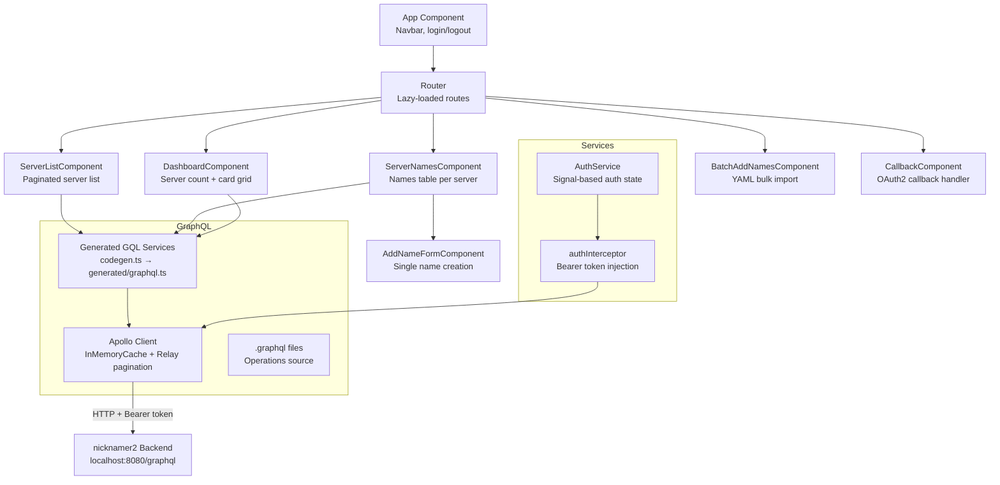

# nicknamer2-web

Angular frontend for the nicknamer2 Discord nickname tracking service.

## Stack

Angular 21, Apollo Angular (GraphQL), Tailwind CSS v4 + DaisyUI, Casdoor OAuth2 PKCE, Vitest.

## Architecture



## Routes

| Route | Component | Description |
|---|---|---|
| `/` | `DashboardComponent` | Server count stat + grid of first 12 servers |
| `/servers` | `ServerListComponent` | Paginated list of all servers (load-more) |
| `/servers/:serverId/names` | `ServerNamesComponent` | Names table + add form (when authed) |
| `/servers/:serverId/names/batch` | `BatchAddNamesComponent` | YAML bulk import |
| `/callback` | `CallbackComponent` | OAuth2 callback → token exchange → redirect |

All routes use `loadComponent` (lazy-loaded). Route params bound via `withComponentInputBinding()`.

## State Management

Exclusively Angular signals — no external state library.

```typescript
// Typical pattern in components
protected readonly edges = signal<ServerEdge[]>([]);
protected readonly loading = signal(true);
protected readonly error = signal<string | null>(null);
protected readonly hasNextPage = signal(false);
```

- `signal()` for mutable local state
- `computed()` for derived state (e.g., `isAuthenticated`)
- `effect()` for reactive side effects (e.g., auto-clear form on success)
- Apollo `valueChanges` Observable bridged into signals via `.subscribe()` + `takeUntilDestroyed()`

## GraphQL

**Client**: `apollo-angular` with `InMemoryCache` Relay-style cursor pagination merging.

**Codegen**: `codegen.ts` introspects the running backend at `http://localhost:8080/graphql` and generates typed Angular services in `src/generated/graphql.ts`.

```bash
# Regenerate after backend schema changes (backend must be running)
npx graphql-codegen --config angular/projects/nicknamer2-web/codegen.ts
```

**Operations** (in `src/app/graphql/`):

| File | Operation | Type |
|---|---|---|
| `get-dashboard.graphql` | `GetDashboard` | Query |
| `get-servers.graphql` | `GetServers` | Query (paginated) |
| `get-server-names.graphql` | `GetServerNames` | Query (paginated) |
| `create-name.graphql` | `CreateName` | Mutation |
| `create-names.graphql` | `CreateNames` | Mutation (batch) |

## Auth

Casdoor OAuth2 PKCE flow:

1. User clicks Login → redirected to Casdoor
2. Casdoor redirects back to `/callback` with auth code
3. `CallbackComponent` exchanges code for JWT, stores in `sessionStorage`
4. `authInterceptor` adds `Authorization: Bearer <token>` to backend requests
5. `AuthService` exposes `isAuthenticated` computed signal

Environment config in `src/environments/`.

## Styling

Tailwind CSS v4 + DaisyUI. All components use inline templates with DaisyUI utility classes (`btn`, `card`, `table`, `alert`, `stats`, `navbar`, etc.). No component-level CSS files.

Styles processed at build time via `process_styles` Bazel macro (PostCSS).

## Commands

```bash
# Build
aspect build //angular/projects/nicknamer2-web

# Test (Vitest + jsdom)
aspect test //angular/projects/nicknamer2-web:test

# Full lint
aspect lint //angular/projects/nicknamer2-web/...
```

## Testing

- **Runner**: Vitest with jsdom (not Karma)
- **GraphQL mocking**: `ApolloTestingModule` + `ApolloTestingController` — expect operations, flush data/errors
- **DOM queries**: `data-testid` attributes
- **Signal inputs**: `fixture.componentRef.setInput()` for required inputs
- **Auth mocking**: plain object with `signal(true)` for `isAuthenticated`
- **Cleanup**: `apolloController.verify()` in `afterEach`

## Environment Variables

| Variable | File | Description |
|---|---|---|
| `serverUrl` | `environment*.ts` | Casdoor server URL |
| `clientId` | `environment*.ts` | Casdoor client ID |
| `appName` | `environment*.ts` | Casdoor app name |
| `organizationName` | `environment*.ts` | Casdoor org name |
| `redirectPath` | `environment*.ts` | OAuth callback path |

**Note**: The GraphQL endpoint (`http://localhost:8080/graphql`) is hardcoded in `graphql.provider.ts`, not configured via environments.
