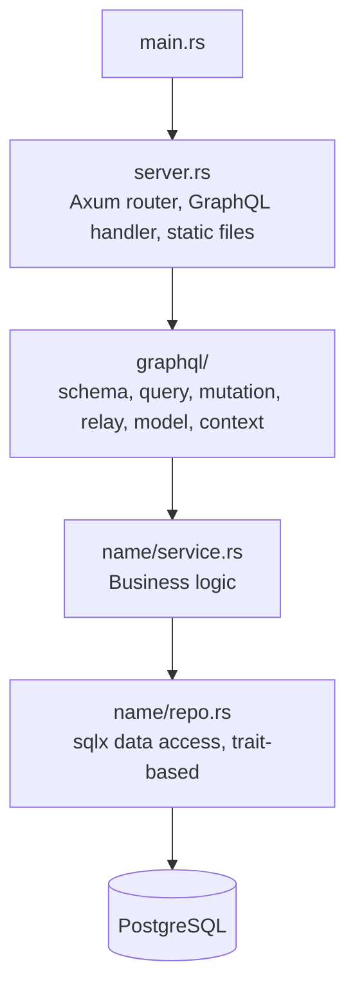
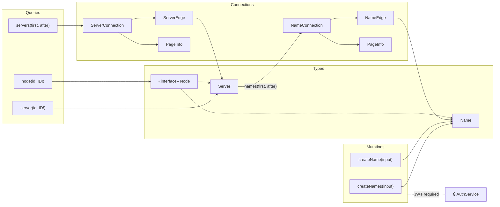

# nicknamer2

Discord nickname tracking service with a Relay-compliant GraphQL API.

## Stack

Rust (edition 2024), Axum, Juniper (GraphQL), sqlx (PostgreSQL), Casdoor (OIDC/JWT auth).

## Architecture



Key patterns:
- **Trait-based repositories**: `NameCreator`, `NameReader`, `NameUpdater`, `NameDeleter`, `NameCounter` — enables testability
- **DAO pattern**: `NameDAO` (sqlx `FromRow`) converts to domain `Name` via `From`
- **Relay Global IDs**: base64-encoded `Type:components` (e.g., `Name:{discord_id}:{discord_server}`)
- **Cursor pagination**: base64-encoded JSON cursors, keyset pagination ordered by `discord_id`
- **DI via GraphQL context**: `Context` holds `Arc<Service<Repo>>`, `Arc<dyn AuthService>`, optional auth token

## Database

Single `names` table:

```sql
CREATE TABLE names (
    id UUID PRIMARY KEY,
    discord_id BIGINT NOT NULL,
    discord_server BIGINT NOT NULL,
    name VARCHAR(255) NOT NULL,
    created_at TIMESTAMPTZ NOT NULL,
    updated_at TIMESTAMPTZ NOT NULL,
    UNIQUE(discord_id, discord_server)
);
```

Migrations run on startup via `migrations::run_migrations()` with embedded SQL.

## GraphQL Schema



## Environment Variables

| Variable | Required | Default | Description |
|---|---|---|---|
| `DB_URL` | Yes | — | PostgreSQL connection string |
| `PORT` | No | `8080` | HTTP bind port |
| `CASDOOR_ISSUER_URL` | No | `http://localhost:8000` | OIDC issuer |
| `CASDOOR_CLIENT_ID` | No | — | Client ID (mutations fail without it) |
| `STATIC_DIR` | No | — | Angular frontend build directory |

## Commands

```bash
# Local dev environment (PostgreSQL on :5433, Casdoor on :8000)
docker-compose -f nicknamer2/docker-compose.yml up -d

# Build
aspect build //nicknamer2/...

# Test (integration tests use testcontainers — need Docker)
aspect test //nicknamer2/...

# Run server
aspect run //nicknamer2/src/bin:nicknamer2

# Single test
aspect test //nicknamer2/src/name:name_repo_test --test_filter="test_name"
```

## Testing

- **Unit tests**: in-source `#[cfg(test)]` modules (e.g., `name.rs` equality checks)
- **Integration tests**: spin up PostgreSQL via `testcontainers`, tagged `requires-network`
- **GraphQL integration test**: full stack through handler → schema → service → DB

## OCI Image

Built on `distroless_cc`, bundles the binary + Angular frontend from `//angular/projects/nicknamer2-web`. Pushed to `ghcr.io/lowkeylab/nicknamer2_server:latest`.
